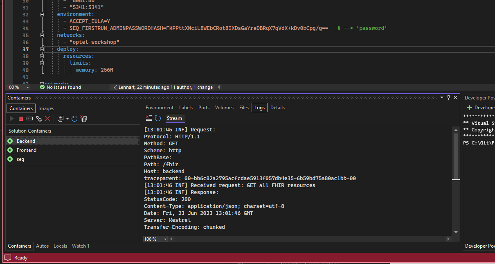
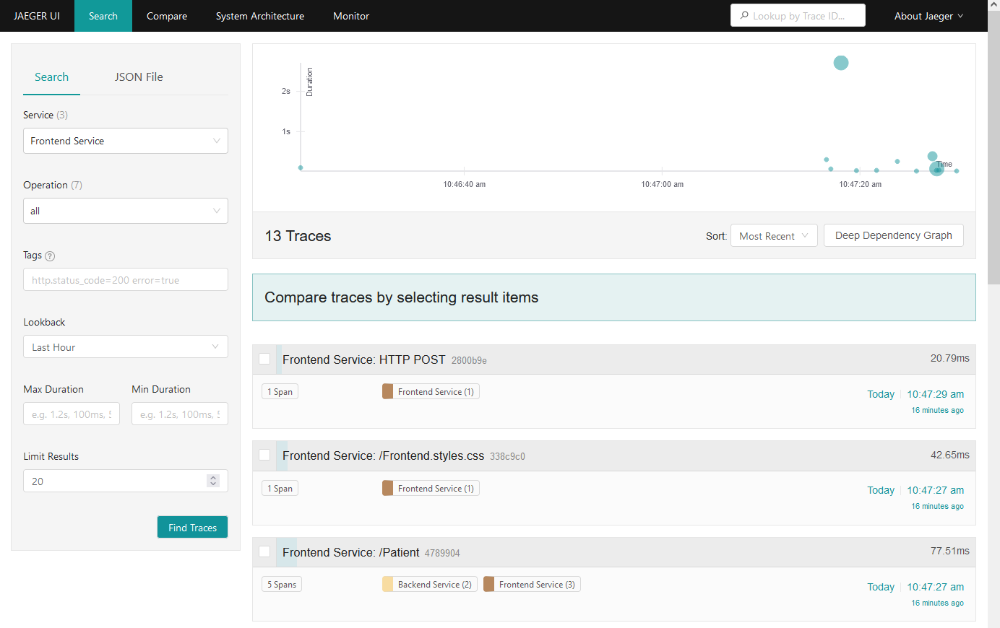
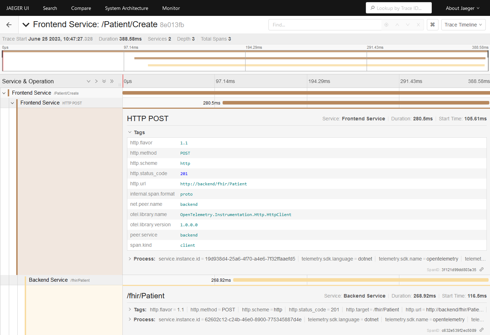
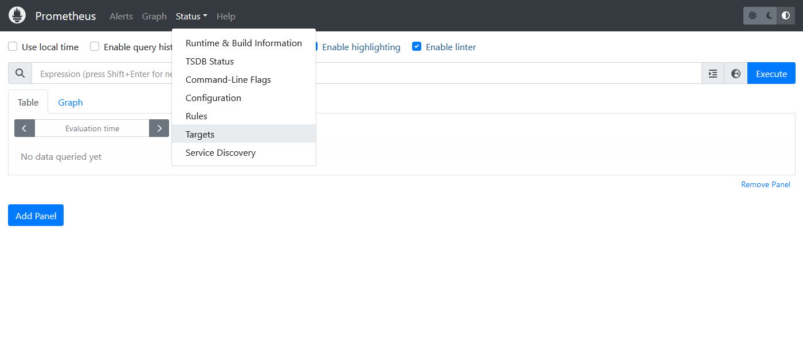
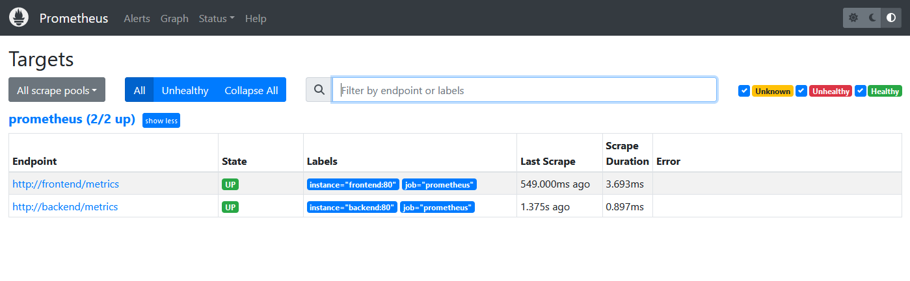

# workshop-opentelemetry
OpenTelemetry - SE Workshopdag - 29 juni 2023


## 1. Structured logging

Voor het loggen maken we gebruik van [Serilog](https://serilog.net/), een logging framework die het makkelijk maakt om structured logging en  verschillende log sinks in te regelen. Voor dit project is Serilog opgezet om naar de Console weg te schrijven. Start het Frontend project in Visual Studio en wacht tot er een webbrowser wordt gestart (of ga zelf handmatig met een browser naar `https://localhost:5001/`). Navigeer rond in de applicatie en inspecteer dan in de container view van Visual Studio onder de tab logs de log output. Doe dit voor zowel de Frontend als de Backend controller.



Bij gebruik van meerdere containers is het onhandig om op verschillende plekken de logs te moten inspecteren. Daarom gaan we een centrale log collector inzetten genaamd [Seq](https://datalust.co/seq)

Indien deze nog draait, stop de applicatie.

Om ons leven makkelijker te maken gaan we Docker gebruiken. We gaan daarom Seq als Docker container inzetten. Hiervoor moet in Visual Studio de `docker-compose.yml` aangepast worden.

`docker-compose.yml`
```
  seq:
    image: datalust/seq
    container_name: seq
    ports:
      - "8081:80"
      - "5341:5341"
    environment:
      - ACCEPT_EULA=Y
      - SEQ_FIRSTRUN_ADMINPASSWORDHASH=FKPPttXNciL8WEbCRot8IXDsGaYreDBRqX7qVdX+kDv0bCpg/g==   # --> 'password'
    networks:
      - "optel-workshop"
    deploy:
      resources:
        limits:
          memory: 256M
```

Rebuild the Visual Studio solution om alle containers in Visual Studio opnieuw te initializeren.

Vervolgens moet de Serilog log configuratie aangepast worden om naar Seq weg te kunnen schrijven. Voeg de Seq sink toe in de appsettings.josn in de sectie `WriteTo`. Vergeet niet om zowel de Frontend als Backend `appsettings.json` aan te passen!

`appsettings.json`
```
  {
    "Name": "Seq",
    "Args": {
      "restrictedToMinimumLevel": "Verbose",
      "serverUrl": "http://host.docker.internal:5341"
    }
  }
```
**NB**: Om vanuit een container op je host (aka je laptop) een andere host te bereiken maak je gebruik van `host.docker.internal` i.p.v. `localhost`. 

In Visual Studio rebuild de solution en start de applicatie.

Ga met je browser naar http://localhost:8081/#
- username: admin
- password: password

Open een andere tab in de browser en ga naar: https://localhost:5001/ 

Navigeer door de applicatie en inspecteer Seq om de logging van de Frontend en Backend terug te zien.

## 2. OpenTelemetry tracing

We gaan nu OpenTelemetry toevoegen en tracing configureren. In zowel Backend als Frontend `Program.cs` moeten de volgende stukjes code worden toegevoegd.  **NB**: mogelijk moet je de `usings` nog goed zetten na het kopiëren, gebruik hiervoor `CTRL + .` op de code waar een rode lijn onder staat.

Mocht je het nog niet gedaan hebben, stop de applicatie.

Backend `Program.cs`
```
// Setup OpenTelemetry
builder.Services.AddOpenTelemetry()
  .WithTracing(tracerProviderBuilder =>
    tracerProviderBuilder
      .AddSource(DiagnosticsConfig.ActivitySource.Name)
      .ConfigureResource(resource => resource
        .AddService(DiagnosticsConfig.ServiceName)
        .AddTelemetrySdk())
      .AddAspNetCoreInstrumentation()
      .AddHttpClientInstrumentation()
      .AddConsoleExporter());
```

Frontend `Program.cs`
```
// Setup OpenTelemetry
builder.Services.AddOpenTelemetry()
  .WithTracing(tracerProviderBuilder =>
    tracerProviderBuilder
      .AddSource(DiagnosticsConfig.ActivitySource.Name)
      .ConfigureResource(resource => resource
        .AddService(DiagnosticsConfig.ServiceName)
        .AddTelemetrySdk())
      .AddAspNetCoreInstrumentation()
      .AddHttpClientInstrumentation()
      .AddConsoleExporter());
```

Start de Frontend applicatie en navigeer door de applicatie.

Als alles goed is gegaan zie je in de Container logs het volgende soort statements langskomen.

```
Activity.TraceId:            11ecf087f3b5b38a274bce21a83dbfd0
Activity.SpanId:             bc7b432d97cd61b0
Activity.TraceFlags:         Recorded
Activity.ActivitySourceName: OpenTelemetry.Instrumentation.AspNetCore
Activity.DisplayName:        /Patient/Create
Activity.Kind:               Server
Activity.StartTime:          2023-06-16T11:43:00.2805429Z
Activity.Duration:           00:00:00.4575948
Activity.Tags:
    net.host.name: localhost
    net.host.port: 5001
    http.method: POST
    http.scheme: https
    http.target: /Patient/Create
    http.url: https://localhost:5001/Patient/Create
    http.flavor: 2.0
    http.user_agent: Mozilla/5.0 (Windows NT 10.0; Win64; x64; rv:109.0) Gecko/20100101 Firefox/114.0
    http.status_code: 302
Resource associated with Activity:
    telemetry.sdk.name: opentelemetry
    telemetry.sdk.language: dotnet
    telemetry.sdk.version: 1.5.0
    service.name: Frontend Service
    service.instance.id: 1c41a278-43c8-44b6-ad11-b1edbc941bcc
```

Log ook in op Seq (http://localhost:8181/#)

Lukt het met behulp van de filter opties in Seq om een request van frontend naar backend te volgen?
Hint: Seq biedt de mogelijkheid om een log event attribuut als column te tonen.

## 3. Jaeger trace monitor

Nu we tracing geconfigureerd hebben in ons project, wordt het tijd om tracing zichtbaar te maken met een monitoring systeem. We gebruiken hier voor [Jaeger](https://www.jaegertracing.io/), maar [Zipkin](https://zipkin.io/) is een goed alternatief. Jaeger heeft zijn eigen standaard en protocollen om met traces om te gaan. Hoewel OpenTelemetry de Jaeger protocollen ondersteund is, heeft OpenTelemetry zijn een eigen protocol (OTLP) en standaard ontwikkelt om zo een breder scala aan systemen en frameworks te kunnen ondersteunen. Jaeger ondersteund dit protocol inmiddels ook en dit is wat we gaan gebruiken om de traces naar Jaeger te versturen.

Mocht je het nog niet gedaan hebben, stop de applicatie.

Als eerste gaan we de Jaeger container inrichten. Voeg het volgende stuk aan de `docker-compose.yml` toe:

`docker-compose.yml`
```
  jaeger:
    image: jaegertracing/all-in-one:latest
    container_name: jaeger
    command: ["--query.max-clock-skew-adjustment", "500ms"]
    ports:
      - "4317:4317"
      - "4318:4318"
      - "16686:16686"
    environment:
      - COLLECTOR_OTLP_ENABLED=true
    networks:
      - "optel-workshop"
```
* Poort `4317`: OpenTelemetry Protocol (OTLP) over gRPC
* Poort `4318`: OpenTelemetry Protocol (OTLP) over HTTP
* Poort `16686`: Jaeger UI

Voeg aan de OpenTelemetry setup in Backend en Frontend  `Program.cs` de volgende regel toe:
    `.AddOtlpExporter(options => options.Endpoint = new Uri(builder.Configuration["Otlp:Endpoint"]))`

De volledige setup ziet er dan als volgt uit

Backend `Program.cs`
```
// Setup OpenTelemetry
builder.Services.AddOpenTelemetry()
  .WithTracing(tracerProviderBuilder =>
    tracerProviderBuilder
      .AddSource(DiagnosticsConfig.ActivitySource.Name)
      .ConfigureResource(resource => resource
        .AddService(DiagnosticsConfig.ServiceName)
        .AddTelemetrySdk())
      .AddAspNetCoreInstrumentation()
      .AddHttpClientInstrumentation()
      .AddOtlpExporter(options => options.Endpoint = new Uri(builder.Configuration["Otlp:Endpoint"]))
      .AddConsoleExporter())
```

Frontend `Program.cs`
```
// Setup OpenTelemetry
builder.Services.AddOpenTelemetry()
  .WithTracing(tracerProviderBuilder =>
    tracerProviderBuilder
      .AddSource(DiagnosticsConfig.ActivitySource.Name)
      .ConfigureResource(resource => resource
        .AddService(DiagnosticsConfig.ServiceName)
        .AddTelemetrySdk())
      .AddAspNetCoreInstrumentation()
      .AddHttpClientInstrumentation()
      .AddOtlpExporter(options => options.Endpoint = new Uri(builder.Configuration["Otlp:Endpoint"]))
      .AddConsoleExporter())
```

Voeg aan de  `appsettings.json` van Backend en Frontend het volgende stuk toe:
```
  "Otlp": {
    "Endpoint": "http://jaeger:4317"
  },
```

Rebuild the Visual Studio solution en start de applicatie. Voer verschillende acties uit in de applicaties zoals het toevoegen en bewerken van FHIR resources.

Open een andere tab in de browser en ga naar: http://localhost:16686/

Ga naar de Search tab en kies bij Service  voor `Frontend Service`  en klik op knop Find Traces. Als het goed is verschijnen er traces van de acties die je inde applicatie had uitgevoerd.



Klik op een trace om meer informatie te zien.



## 4. Manual tracing

We zien in Jaeger op dit moment alleen de automatisch geïnstrumenteerde code, maar het is ook mogelijk om handmatig je code te instrumenteren.

Hiervoor maakt OpenTelemetry gebruik van Microsoft's reeds bestaande diagnostic framework gebaseerd door een Span te mappen op een Activity.

Mocht je het nog niet gedaan hebben, stop de applicatie.

Voer op een aantal plaatsen in de code een Activity toe en geef die een aantal tags mee.

```
  // Use custom activity
  using var activity = DiagnosticsConfig.ActivitySource.StartActivity("<<Naam van de span>>");
  activity?.SetTag("yes", 1);
  activity?.SetTag("no", "Bye, World!");
  activity?.SetTag("frizzle", new int[] { 3, 2, 1 });
```

In OpenTelemetry bestaat er ook het concept van [Baggage](https://opentelemetry.io/docs/concepts/signals/baggage/), daar kan je context data in kwijt die tussen de verschillende spans in een trace wordt doorgegeven en die voorbij services barrières gebruikt kan worden.

Om een Baggage item te zetten:
```
  Baggage.SetBaggage("ExampleItem", "The information");
```

Om de baggage in een andere service uit te lezen:
```
  // Read context information from span context
  var baggageItem = Baggage.Current.GetBaggage("ExampleItem");
  // Add baggage item as tag to the current span
  activity?.SetTag("ExampleItemReceived", baggageItem);
```

Rebuild in Visual Studio de solution en start de applicatie.

Klik door de applicatie om wat verkeer te genereren.

Ga naar Jaeger (http://localhost:16686/) en inspecteer de traces, zie je custom spans en tags terug?

Is het gelukt om context informatie die in de Frontend Service is gezet terug te zien in een span in de Backend service in Jaeger?

Om de baggage items als context tussen de services te propageren, wordt gebruik gemaakt van HTTP headers. Kijk  eens in Seq en probeer de `baggage` HTTP headers terug te vinden.

## 5. Built-in metrics

We gaan nu verschillende metrics toe voegen aan ons project en inzichtelijk maken met [Prometheus](https://prometheus.io/) We beginnen eerste met de automatische metrics die we voor gratis met .NET meekrijgen. In de volgende secties gaan we an de slag met eigen verzonnen metrics en het zichtbaar maken in Prometheus.

In .NET heb je de `Meter` class. Met een `Meter` geef je een naam op en kan je nieuwe metric mee aanmaken. Een metric wordt ook wel type instrument genoemd. Een voorbeeld van een metric is een `Counter` die kan tellen hoe vaak iets gebeurd. Denk aan het bijhouden van de hoeveelheid request op een endpoint. Voor een overzicht van de soorten metrics in .NET, zie : https://learn.microsoft.com/en-us/dotnet/core/diagnostics/metrics-instrumentation#types-of-instruments

Mocht je het nog niet gedaan hebben, stop de applicatie.

Om Metrics te gaan gebruiken binnen het project moet het volgende stuk code aan de OpenTelemetry setup in Backend en Frontend  `Program.cs` toegevoegd worden:

```
.WithMetrics(metricsProviderBuilder =>
  metricsProviderBuilder
    .ConfigureResource(resource => resource
      .AddService(DiagnosticsConfig.ServiceName))
    .AddAspNetCoreInstrumentation()
    .AddConsoleExporter());
```

De totale OpenTelemetry setup ziet er dan als volgt uit:

`Program.cs`
```
// Setup OpenTelemetry
builder.Services.AddOpenTelemetry()
  .WithTracing(tracerProviderBuilder =>
    tracerProviderBuilder
      .AddSource(DiagnosticsConfig.ActivitySource.Name)
      .ConfigureResource(resource => resource
        .AddService(DiagnosticsConfig.ServiceName)
        .AddTelemetrySdk())
      .AddAspNetCoreInstrumentation()
      .AddHttpClientInstrumentation()
      .AddOtlpExporter(options => options.Endpoint = new Uri(builder.Configuration["Otlp:Endpoint"]))
      .AddConsoleExporter())
  .WithMetrics(metricsProviderBuilder =>
    metricsProviderBuilder
      .ConfigureResource(resource => resource
        .AddService(DiagnosticsConfig.ServiceName))
      .AddAspNetCoreInstrumentation()
      .AddConsoleExporter());
```

Rebuild in Visual Studio de solution en start de applicatie. Navigeer met een browser door de applicatie.

Als alles goed is geconfigureerd zie je in Visual Studio in de Docker container log voor bijvoorbeeld Frontend de volgende metrics verschijnen:
```
Export http.server.duration, Measures the duration of inbound HTTP requests., Unit: ms, Meter: OpenTelemetry.Instrumentation.AspNetCore/1.0.0.0
(2023-06-26T08:58:42.6906880Z, 2023-06-26T09:07:22.5959577Z] http.flavor: 2.0 http.method: GET http.route: {controller=Home}/{action=Index}/{id?} http.scheme: https http.status_code: 200 net.host.name: localhost net.host.port: 5001 Histogram
Value: Sum: 3470.2558000000004 Count: 6 Min: 124.4243 Max: 1774.172 
(-Infinity,0]:0
(0,5]:0
(5,10]:0
(10,25]:0
(25,50]:0
(50,75]:0
(75,100]:0
(100,250]:2
(250,500]:2
(500,750]:0
(750,1000]:1
(1000,2500]:1
(2500,5000]:0
(5000,7500]:0
(7500,10000]:0
(10000,+Infinity]:0
```

## 6. Custom metrics

Nu gaan we zelf metrics implementeren voor ons project.

Mocht je het nog niet gedaan hebben, stop de applicatie.

Om een nieuwe `Meter` te registreren in OpenTelemetry moet in `Program.cs` van zowel de Frontend als Backend de volgende regel aan de OpenTelemetry setup worden toegevoegd.

```
  .AddMeter(DiagnosticsConfig.Meter.Name)
```

De totale OpenTelemetry setup ziet er dan als volgt uit:

`Program.cs`
```
// Setup OpenTelemetry
builder.Services.AddOpenTelemetry()
  .WithTracing(tracerProviderBuilder =>
    tracerProviderBuilder
      .AddSource(DiagnosticsConfig.ActivitySource.Name)
      .ConfigureResource(resource => resource
        .AddService(DiagnosticsConfig.ServiceName)
        .AddTelemetrySdk())
      .AddAspNetCoreInstrumentation()
      .AddHttpClientInstrumentation()
      .AddOtlpExporter(options => options.Endpoint = new Uri(builder.Configuration["Otlp:Endpoint"]))
      .AddConsoleExporter())
  .WithMetrics(metricsProviderBuilder =>
    metricsProviderBuilder
      .ConfigureResource(resource => resource
        .AddService(DiagnosticsConfig.ServiceName))
      .AddMeter(DiagnosticsConfig.Meter.Name)
      .AddAspNetCoreInstrumentation()
      .AddConsoleExporter());
```

In `DiagnosticConfig` in zowel Frontend als Backend staat een voorbeeld van een simpele counter gekoppeld aan de `Meter` die je zojuist geregistreerd hebt. Deze counter kan je gebruiken om het aantal requests bij te houden.

`DiagnosticConfig.cs`
```
  public static Counter<long> RequestCounter = Meter.CreateCounter<long>("app.frontend.request_counter");
```

Om de counter te gebruiken kan je in bijvoorbeeld in  `PatienController` bij methode `Index()` het volgende stuk code toevoegen:

`PatientController.cs`
```
  DiagnosticsConfig.RequestCounter.Add(1,
    new("Action", nameof(Index)),
    new("Controller", nameof(PatientController)));
```

Elke keer als je met de webbrowser het overzicht van de Patient pagina opvraagt wordt de counter met 1 opgehoogd.

Hetzelfde kan je aan de Backend doen: 

`Program.cs`
```
  app.MapGet("/fhir", async (FhirResourceDb db, ILogger<Program> logger) =>
  {
    logger.LogInformation("Received request: GET all FHIR resources");

	// Update custom metric
    DiagnosticsConfig.RequestCounter.Add(1,
      new("Action", "GET /fhir"),
      new("Controller", "Backend API"));
    
    return await db.FhirResources.ToListAsync();
  });
```

Probeer zelf een eigen metric te verzinnen en die toe te passen in het project.

Als je zelf een metric hebt bedacht hebt en doorgevoerd in het project, kan je in Visual Studio de solution rebuilden en de applicatie starten. Navigeer met een browser door de applicatie.

Als alles goed is geconfigureerd zie je in Visual Studio in de Docker container log je custom metric verschijnen.

Voorbeeld van de RequestCounter metric in output log:
```
Export app.frontend.request_counter, Meter: Frontend Service
(2023-06-26T10:07:01.8339187Z, 2023-06-26T10:08:11.4508339Z] Action: Index Controller: PatientController LongSum
Value: 6
```

## 7. Prometheus

Nu gaan we de Metrics visualiseren in [Prometheus](https://prometheus.io/)

Mocht je het nog niet gedaan hebben, stop de applicatie.

Ook Prometheus kunnen we als Docker container opzetten. Voeg in Visual Studio het volgende stuk toe aan docker-compose:

`docker-compose.yml`
```
  prometheus:
    image: prom/prometheus:latest
    container_name: prometheus
    command:
      - --config.file=/etc/prometheus.yml
      - --web.enable-remote-write-receiver
      - --enable-feature=exemplar-storage
    volumes:
      - ../config/prometheus/prometheus.yml:/etc/prometheus.yml
    ports:
      - "9090:9090"
    networks:
      - "optel-workshop"
```

Prometheus werkt net iets anders in het verzamelen van metrics dan je misschien verwacht. In plaats van dat er data naar Prometheus verstuurd wordt, geef je in Prometheus aan waar het data kan opvragen. Prometheus werkt dus op basis van een pull mechanisme (in combinatie met geconfigureerd tijdsinterval). De informatie die Prometheus nodig heeft om alle metric endpoints te bevragen staat in `<project_home>\config\prometheus\prometheus.yml`

`prometheus.yml`
```
global:
  scrape_interval: 5s
  evaluation_interval: 5s

scrape_configs:
  - job_name: prometheus
    #scheme: https
    #tls_config:
    #  insecure_skip_verify: true
    static_configs:
      - targets: [ 'frontend', 'backend' ]
```
 
De targets zijn de Docker service naam voor de frontend en backend.

In zowel Frontend als Backend `Program.cs` moet de volgende regel aan de OpenTelemetry setup worden toegevoegd:
```
  .AddPrometheusExporter()
```

De totale OpenTelemetry setup ziet er dan als volgt uit:

`Program.cs`
```
// Setup OpenTelemetry
builder.Services.AddOpenTelemetry()
  .WithTracing(tracerProviderBuilder =>
    tracerProviderBuilder
      .AddSource(DiagnosticsConfig.ActivitySource.Name)
      .ConfigureResource(resource => resource
        .AddService(DiagnosticsConfig.ServiceName)
        .AddTelemetrySdk())
      .AddAspNetCoreInstrumentation()
      .AddHttpClientInstrumentation()
      .AddOtlpExporter(options => options.Endpoint = new Uri(builder.Configuration["Otlp:Endpoint"]))
      .AddConsoleExporter())
  .WithMetrics(metricsProviderBuilder =>
    metricsProviderBuilder
      .ConfigureResource(resource => resource
        .AddService(DiagnosticsConfig.ServiceName))
      .AddAspNetCoreInstrumentation()
      .AddPrometheusExporter()
      .AddConsoleExporter());
```

Verder moet in `Program.cs` in zowel Frontend als Backend ook de volgende regel worden toegevoegd.

```
  // Enable Prometheus scraping endpoint
  app.UseOpenTelemetryPrometheusScrapingEndpoint();
```

Deze regel moet na `var app = builder.Build();`.

Rebuild in Visual Studio de solution en start de applicatie.

In Visual studio in de container tab verschijnt een container genaamd `prometheus`.

Prometheus werkt dus door het scrapen van end-points. Als alles goed geconfigureerd is zou de Frontend en Backend applicaties nu een metrics endpoint moeten exposen die Prometheus kan bevragen.

https://localhost:5001/metrics
https://localhost:6001/metrics

Als je nog niet door de applicatie hebt genavigeerd en de counters nog allemaal leeg zijn dan zullen bovenstaand endpoints alleen een `# EOF`  retourneren. Het metrics equivalent van `null`.

Navigeer door de applicatie om de counters te vullen.

Controleer dat https://localhost:5001/metrics en https://localhost:6001/metrics nu een pagina vol met metrics serveren.

Ga nu naar Prometheus UI zelf: http://localhost:9090/

Via de menubalk bovenin: `Status > Targets`



Als Prometheus de metric endpoints van Frontend en Backend succesvol kan bevragen zie je het volgende:



Ga naar de Graph interface: http://localhost:9090/graph

Klik op de wereldbol (?) naast knop Execute en zoek je eigen metric op. Klik daarna op Execute en kies i.p.v. de Table view de Graph view.

Experimenteer met Prometheus om de verschillende metric inzichtelijk te krijgen.

## 8. OTEL Collector

We komen nu aan op het punt waar OpenTelemetry op dit moment nog vol in ontwikkeling bezig is. De standaard voor metrics is nog niet Stable. Standaard ondersteund Prometheus ook (nog) niet OpenTelemetry. Toch kunnen we Prometheus koppelen met OpenTelemetry door gebruik te maken van OTLP en de OpenTelemetry collector.

Traces kunnen ook rechtstreeks naar de collector worden verstuurd. En we zullen de Tracing systeem aanpassen van Jaeger naar Grafana [Tempo](https://grafana.com/oss/tempo/)

Mocht je het nog niet gedaan hebben, stop de applicatie.

Pas in Visual Studio in docker-compose aan. 

We voegen de OTEL collector toe en passen de `volume` configuratie van Prometheus aan naar. We zullen ook de traces naar de OTEL collector wegschrijven en die zichtbaar maken in Grafana en Tempo, dus Jaeger commentariëren we uit en de container definities voor Tempo en Grafana voegen we toe. 

`docker-compose.yml`
```
  #jaeger:
  #  image: jaegertracing/all-in-one:latest
  #  container_name: jaeger
  #  command: ["--query.max-clock-skew-adjustment", "500ms"]
  #  ports:
  #    - "4317:4317"
  #    - "4318:4318"
  #    - "16686:16686"
  #  environment:
  #    - COLLECTOR_OTLP_ENABLED=true
  #  networks:
  #    - "optel-workshop"
  
  prometheus:
    image: prom/prometheus:latest
    container_name: prometheus
    command:
      - --config.file=/etc/prometheus.yml
      - --web.enable-remote-write-receiver
      - --enable-feature=exemplar-storage
    volumes:
      - ../config/prometheus/prometheus.otel.yml:/etc/prometheus.yml
    ports:
      - "9090:9090"
    networks:
      - "optel-workshop"

  otel-collector:
    image: otel/opentelemetry-collector:0.79.0
    container_name: otel-collector
    command: [ "--config=/etc/otel-collector.yml" ]
    volumes:
      - ../config/otel-collector/otel-collector.yml:/etc/otel-collector.yml
    ports:
      - "4317:4317"
      - "4318:4318"
      - "9201:9201"
    networks:
      - "optel-workshop"

  tempo:
    image: grafana/tempo:latest
    container_name: tempo
    command: [ "-config.file=/etc/tempo.yml" ]
    volumes:
      - ../config/grafana/tempo.yml:/etc/tempo.yml
      - ../config/grafana/tempo-data:/tmp/tempo
    ports:
      - "3200"  # tempo
      - "4317"  # otlp grpc
      - "4318"  # otlp http
    networks:
      - "optel-workshop"
 
  grafana:
    image: grafana/grafana:9.5.3
    container_name: grafana
    volumes:
      - ../config/grafana/grafana-datasources.yml:/etc/grafana/provisioning/datasources/datasources.yaml
    environment:
      - GF_AUTH_ANONYMOUS_ENABLED=true
      - GF_AUTH_ANONYMOUS_ORG_ROLE=Admin
      - GF_AUTH_DISABLE_LOGIN_FORM=true
      - GF_FEATURE_TOGGLES_ENABLE=traceqlEditor
    ports:
      - "3000:3000"
    networks:
      - "optel-workshop"
```

Pas in `Program.cs` voor zowel Frontend als Backend de OpenTelemetry setup aan.

We verwijderen de Prometheus exporter en passen die aan naar:

```
  .AddOtlpExporter(options => options.Endpoint = new Uri(builder.Configuration["Otlp:Endpoint"]))
```

We verwijderen de Prometheus scraping endpoint, die gaat namelijk nu via de OTEL collector. Dus verwijder of commentarieer de volgende regel uit:

```
  // Enable Prometheus scraping endpoint
  //app.UseOpenTelemetryPrometheusScrapingEndpoint();
```

De totale OpenTelemetry setup ziet er dan als volgt uit:

`Program.cs`
```
// Setup OpenTelemetry
builder.Services.AddOpenTelemetry()
  .WithTracing(tracerProviderBuilder =>
    tracerProviderBuilder
    .AddSource(DiagnosticsConfig.ActivitySource.Name)
    .ConfigureResource(resource => resource
      .AddService(DiagnosticsConfig.ServiceName)
      .AddTelemetrySdk())
    .AddAspNetCoreInstrumentation()
    .AddHttpClientInstrumentation()
    .AddOtlpExporter(options => options.Endpoint = new Uri(builder.Configuration["Otlp:Endpoint"]))
    .AddConsoleExporter())
  .WithMetrics(metricsProviderBuilder =>
    metricsProviderBuilder
      .ConfigureResource(resource => resource
        .AddService(DiagnosticsConfig.ServiceName))
      .AddMeter(DiagnosticsConfig.Meter.Name)
      .AddAspNetCoreInstrumentation()
      .AddOtlpExporter(options => options.Endpoint = new Uri(builder.Configuration["Otlp:Endpoint"]))
      .AddConsoleExporter());
```

Pas in `appsettings.json` de OTLP endpoint aan.

`appsettings.json`
```
  "Otlp": {
    "Endpoint": "http://otel-collector:4317"
  },
```

Rebuild in Visual Studio de solution en start de applicatie. Navigeer met een browser door de applicatie.

Ga naar Grafana Dashboard: http://localhost:3000/

Kies in menu links voor Explore

Kies dan in Dropdown of voor Prometheus of voor Tempo en verken je metrics en traces.

De "gratis" default setup van Grafana is nog al Spartaans en geeft weinig inzichten.

Kijk voor een uitgebreider voorbeeld bijvoorbeeld eens naar: https://github.com/grafana/intro-to-mlt#running-the-demonstration-environment